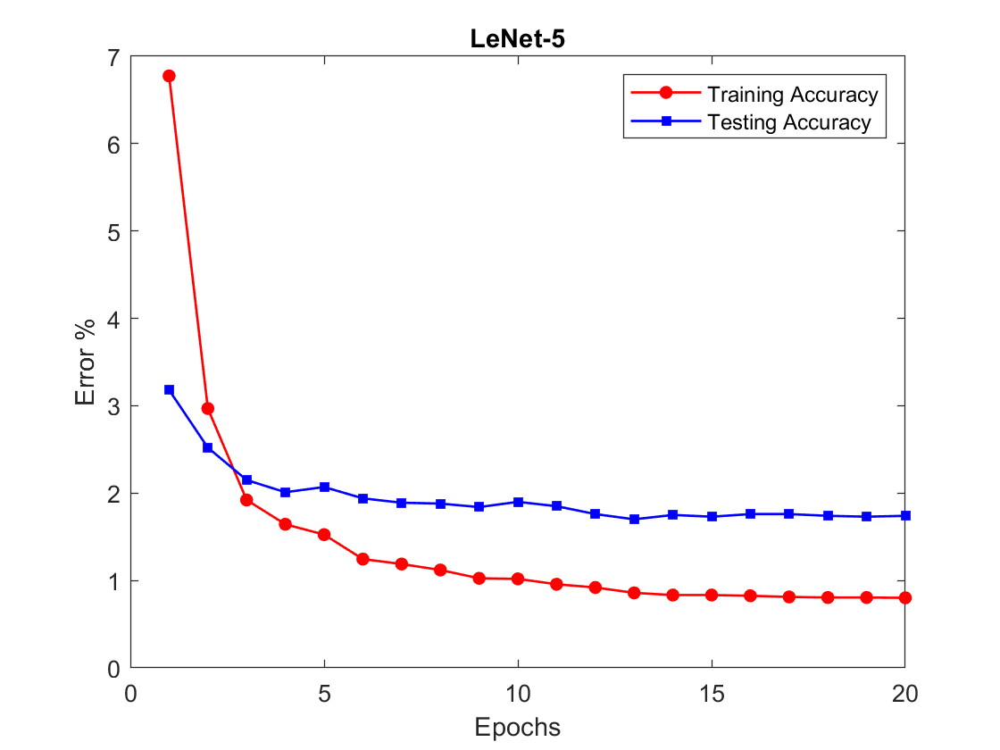

# LeNet-5_Project
An implementation of LeNet-5 convolutional neural network used for the recognition of handwritten digits, based on the original paper with some alterations. The performance of the original architecture is compared to minimally tweaked architecture which utilizes the Adam optimizer which extends stochastic gradient descent. This work is implemented in Tensorflow 2.0.

# Results
Though both implementations are high performing on the MNIST data set, the model using Adam is more performant, achieving near-zero classification error after 20 epochs.

